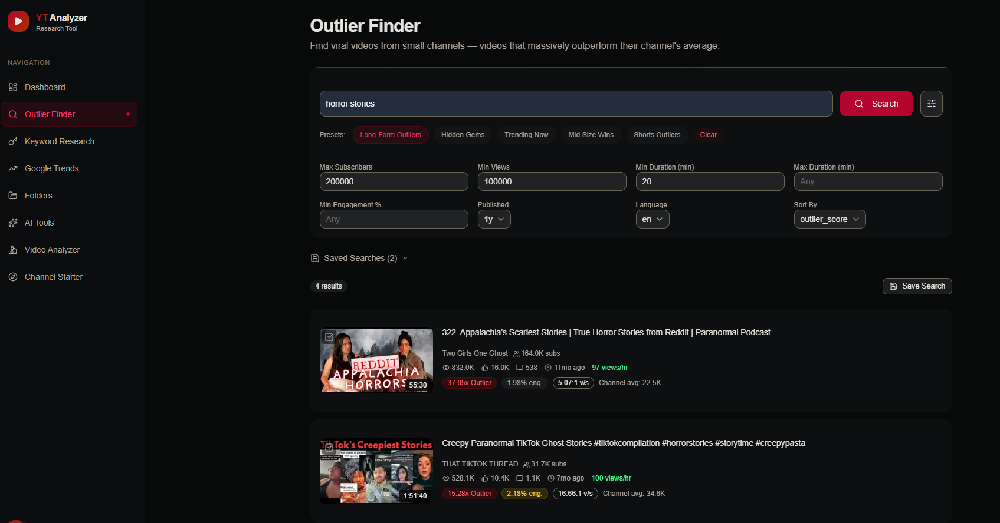
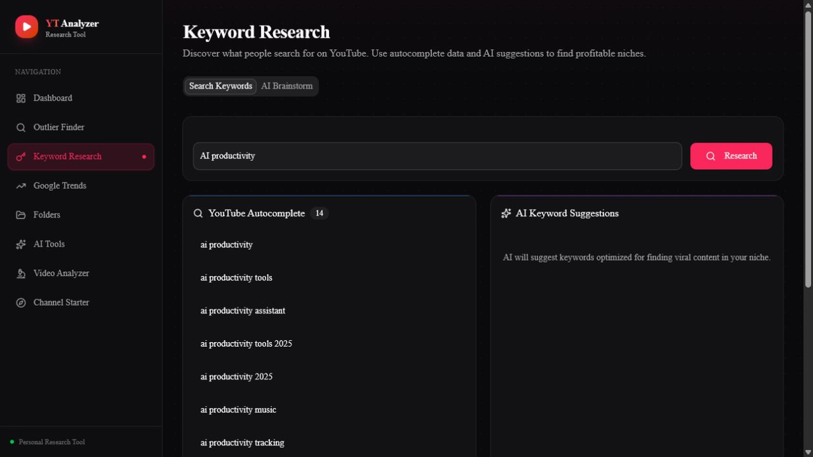

# YT Analyzer

A personal YouTube research tool. It helps answer two questions with evidence you can inspect: which channel to build, and which video to make next.

The app collects measurable facts from the YouTube Data API, calculates outlier metrics from them, and keeps the reasoning visible. It does not invent scores when the underlying data is missing — it reports insufficient data instead.

Built with **Next.js 16**, **React 19**, **TypeScript**, **Tailwind CSS 4**, **Prisma**, and **SQLite**.

## Features

- **Channel Workspaces** - Keep separate planned, active, paused, and archived channel concepts. Searches, folders, and saved evidence are scoped to the selected workspace, while public video and channel data is shared across all of them.
- **Opportunity Lab** - Analyze a video, a channel, or a topic query. Raw statistics, calculated metrics, sample size, and confidence are shown separately so you can see what each conclusion rests on.
- **Ideas** - Collect saved evidence and manual observations about topics, titles, thumbnails, and formats into the folders behind a video decision.

## Outlier metric

Performance is measured as a **recent-median view ratio** rather than a lifetime average:

- Comparable uploads are drawn from the channel's uploads playlist within a 180-day window, up to 20 videos, requiring at least 5 to produce a score.
- Long-form videos, Shorts, and livestreams are classified and compared separately. Shorts are videos of 180 seconds or less.
- The target video is excluded from its own baseline.
- Every stored score carries its metric name, formula version (`recent-median-v1`), sample size, comparison window, format, and collection time.

Lifetime-average performance is retained as an explicitly labeled legacy metric. When a baseline cannot be built, the result is an insufficient-data state, not a fallback number.

## Screenshots

### Outlier Finder



### Keyword Research



## API Setup

Requires a Google Cloud project with YouTube Data API v3 enabled.

| API | Used for | Auth | Required |
|-----|----------|------|----------|
| YouTube Data API v3 | Video search, metadata, and channel stats | `YOUTUBE_API_KEY` | Yes |
| Gemini via `@google/genai` | Optional AI assistance on top of collected evidence | Vertex AI project and location | No |

Core workflows — managing workspaces, collecting evidence, calculating outliers, and organizing ideas — run without any model provider configured. Nothing silently falls back to a different provider when one is unavailable.

The app also uses public, non-key integrations:

- YouTube autocomplete via the public suggest endpoint
- YouTube transcript extraction via `youtube-transcript`

## Environment Variables

Create a local `.env` file:

```env
DATABASE_URL="file:./dev.db"
YOUTUBE_API_KEY=your_youtube_data_api_v3_key
```

Only needed if you enable the optional Gemini features:

```env
GOOGLE_PROJECT_ID=your_google_cloud_project_id
GOOGLE_CLOUD_LOCATION=us-central1
```

## Getting Started

```bash
npm install
npx prisma migrate dev
npm run dev
```

Open [http://localhost:3000](http://localhost:3000) to use the app locally.

## Tests

```bash
npm test
```

Covers the outlier metric — medians, baseline exclusions, format separation, insufficient samples — and workspace isolation across folders, searches, and saved evidence.
